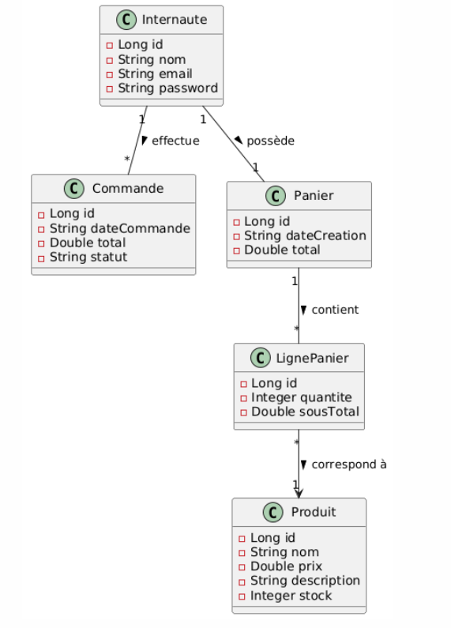
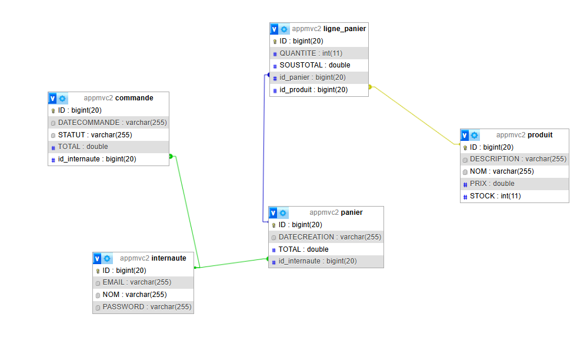
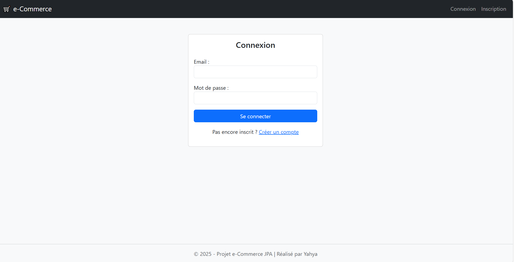
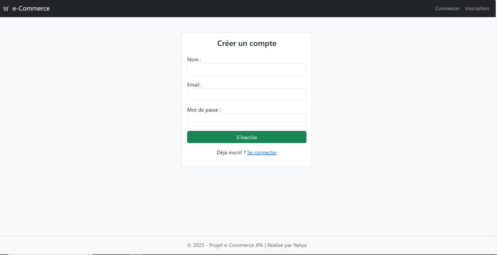
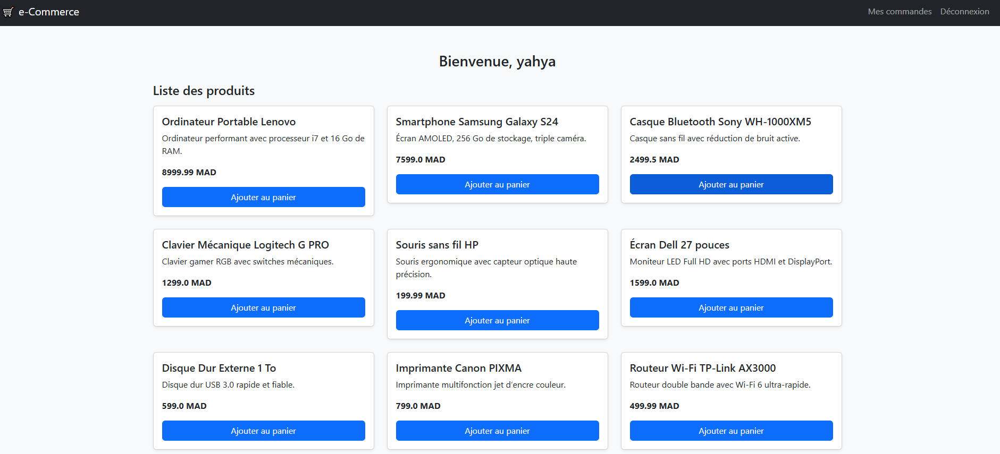
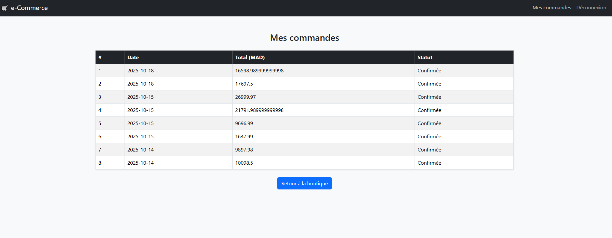
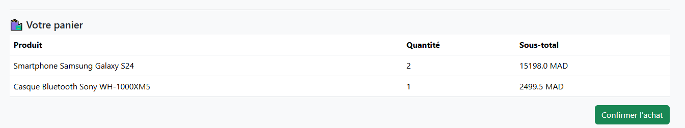

# 🛒 Application Web e-Commerce — MVC2 & JPA

## 🎯 Objectif du projet

L’objectif principal de cet atelier est de **maîtriser l’API JPA (Java Persistence API)** à travers la mise en place d’une **application web simulant le comportement d’un site e-commerce**.  
Cette application respecte le modèle **MVC2**, où la couche **contrôleur** est gérée par des **Servlets** dédiées à chaque entité fonctionnelle (Internaute, Produit, Panier, Commande…).

---

## 🧩 Architecture du projet

Le projet repose sur une architecture **MVC2** :
- **Modèle (Model)** : les entités JPA qui représentent les tables de la base de données.
- **Vue (View)** : les pages JSP utilisant JSTL pour afficher les données.
- **Contrôleur (Controller)** : les Servlets assurant la liaison entre la vue et le modèle.


---

## ⚙️ Outils et technologies utilisées

| Composant | Technologie / Outil  |
|------------|----------------------|
| IDE | IntelliJ IDEA        |
| Serveur d’application | WildFly              |
| ORM | JPA (EclipseLink)    |
| Base de données | MySQL                |
| Gestionnaire de dépendances | Maven                |
| Langage | Java 17              |
| Interface web | JSP, JSTL, Bootstrap |

---

## 🧱 Étapes de réalisation

### 🔹 Étape 1 — Modélisation UML

Réalisation d’un **diagramme de classes** représentant la gestion d’un site e-commerce, en se concentrant sur :
- la gestion du **panier** ,
- la gestion du **produit** , 
- la gestion des **internautes (clients)** .

📘 **Diagramme de classes :**


---

### 🔹 Étape 2 — Création du projet Web

1. Création d’un **projet Web dynamique** avec un module web de version ≥ 3.0.
2. Conversion du projet en **projet Maven**.
3. Ajout des dépendances nécessaires dans le fichier `pom.xml`.

```xml
<!-- Dépendance MySQL -->
<dependency>
    <groupId>mysql</groupId>
    <artifactId>mysql-connector-java</artifactId>
    <version>8.0.12</version>
</dependency>

<!-- Dépendance JPA -->
<dependency>
    <groupId>jakarta.persistence</groupId>
    <artifactId>jakarta.persistence-api</artifactId>
    <version>3.1.0</version>
</dependency>
```
### 🔹 Étape 3 — Couche Modèle (Persistence)

- **Création des entités JPA** : `Internaute`, `Produit`, `Panier`, `LignePanier`, `Commande`.  
- **Configuration de `persistence.xml`** pour la connexion à MySQL.  
- **Génération automatique du schéma de base de données** via les annotations JPA.  

📘 **Schéma de la base de données :**  
  

---

### 🔹 Étape 4 — Couche Contrôleur (Servlets MVC2)

Chaque module fonctionnel dispose d’une **unique Servlet** gérant plusieurs actions à l’aide du paramètre `action` :

| Servlet                  | Rôle                                                       |
|---------------------------|-----------------------------------------------------------|
| `InternauteController`    | Gère l’inscription, la connexion et la déconnexion des internautes |
| `CommandeController`      | Gère la confirmation des commandes et l’affichage de l’historique |
| `ProduitController`       | Gère la liste des produits disponibles (vitrine)         |
| `PanierController`        | Gère les ajouts et suppressions d’articles du panier     |


---

### 🔹 Étape 5 — Couche Service (Logique métier)

Les services utilisent **l’injection d’un `EntityManager`** pour gérer les opérations JPA.

Exemples :
- `InternauteService` → inscription et authentification.
- `PanierService` → création du panier.
- `CommandeService` → confirmation et enregistrement d’une commande.

Grâce à **CDI**, l’`EntityManager` peut être injecté directement dans les services, améliorant la modularité et la maintenance.

---

### 🧠 Points clés du projet

- Application **100% basée sur MVC2 et JPA**.
- **Séparation claire des responsabilités** : Model / View / Controller.
- Persistance gérée via **EclipseLink** et **annotations JPA**.
- Utilisation de **transactions JPA** pour assurer la cohérence des données.
- Intégration de **CDI** pour l’injection de dépendances.
- Pages JSP dynamiques avec **JSTL** pour simplifier la logique côté vue.

---

### 🚀 Fonctionnalités principales

- ✅ Inscription et authentification d’un internaute
- ✅ Ajout et suppression d’articles dans le panier
- ✅ Validation du panier et création d’une commande
- ✅ Consultation de l’historique des commandes

---


## 🖼️ Captures d’écran du site

### 1️⃣ Page de connexion (Login)


### 2️⃣ Page d'inscription (Register)


### 3️⃣ Liste des produits (Vitrine)


### 4️⃣ Historique des commandes


### 5️⃣ Panier



### 🧠 Améliorations possibles

- Ajout d’un **module d’administration**.
- Implémentation d’un **système de paiement simulé**.
- **Tests unitaires JUnit** pour les services JPA.


---

## 🏁 Conclusion

Ce projet illustre la mise en œuvre complète d’une **application web e-Commerce** en utilisant les technologies **Java EE / Jakarta EE**, avec un focus sur **JPA, MVC2 et CDI**.

Grâce à ce projet, nous avons pu :
- Comprendre et appliquer les **concepts de persistance** avec JPA et EclipseLink.
- Mettre en place une **architecture MVC2** claire, séparant la logique métier, la présentation et le contrôle des actions.
- Exploiter **CDI** pour l’injection de dépendances et la gestion automatique du cycle de vie des services et de l’`EntityManager`.
- Développer des **fonctionnalités concrètes** : gestion des internautes, des produits, des paniers et des commandes.
- Produire une application maintenable, modulable et extensible pour de futures améliorations (module admin, paiement, tests unitaires…).

Ce projet constitue une **base solide** pour approfondir les bonnes pratiques en développement Java EE, en combinant persistance, architecture MVC et gestion des dépendances, tout en offrant une expérience pratique d’une application web complète.
